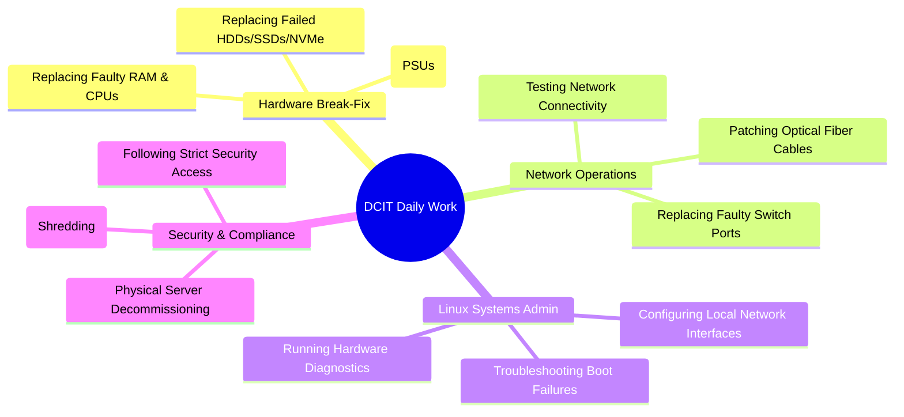

# ☁️ AWS Data Centre IT Support Technician: Guide & Lab

An **AWS Data Centre IT Support Technician (DCIT)** is the hands-on force that keeps the physical infrastructure of AWS running. While software engineers configure virtual servers (EC2 instances) from their laptops, DCITs work inside the physical data centres (large, climate-controlled warehouses) managing the physical server racks, fiber cabling, and hardware components.

---

## 📋 Role Breakdown: Duties & Responsibilities

If you get hired as an AWS Data Centre IT Support Technician, your typical day will involve:



### 1. Hardware Break-Fix
When a server in the cloud fails, an automated ticket is generated. You will locate the server in the rack (using LED locator lights), pull the server chassis out, open it, and replace faulty parts:
* **Storage:** Replacing failed HDDs, SSDs, or NVMe cards.
* **Memory & Processing:** Swapping out dead RAM sticks or processors.
* **Power:** Swapping redundant Power Supply Units (PSUs) without shutting down the server.

### 2. Network Triage & Cabling
Data centres run on massive high-speed networks. You will run, clean, and test network connections:
* **Optical Fiber:** Cleaning fiber tips (using click-cleaners) and inspecting them for dust (the #1 cause of fiber signal loss).
* **Switching:** Troubleshooting port status, patching cables, and configuring network interfaces.

### 3. Linux Systems Administration
Servers do not have monitors. You will connect a laptop directly to the server's serial port (console) to troubleshoot:
* Diagnosing boot failures (GRUB bootloader issues).
* Verifying BIOS/UEFI hardware configurations.
* Running diagnostics to isolate kernel panic errors.

### 4. Security & Compliance
AWS takes security extremely seriously. When a storage drive is replaced:
* It must be magnetically wiped (degaussed) or physically shredded to ensure no customer data escapes the building.

---

## 🛠️ AWS Data Centre IT Support Simulation Lab

This lab simulates the command-line troubleshooting tasks a DCIT performs when diagnosing a server over a console connection. We will use a Linux VM (or Ubuntu WSL) to perform hardware audits, locate system errors, troubleshoot network interfaces, and securely wipe storage.

### 📥 Requirements:
* Access to a Linux command-line (Ubuntu VM or WSL).

---

### 🔍 Task 1: Hardware Resource Auditing
When onboarding or diagnosing a server, you must run commands to verify what hardware is installed. Run these commands on your Linux terminal:

```bash
# 1. View CPU architecture details
lscpu

# 2. Check total physical memory (RAM) and current utilization
free -h

# 3. List all storage drives, partitions, and sizes
lsblk

# 4. List all PCI devices (NICs, RAID controllers, GPUs)
lspci

# 5. Display details of all hardware components (requires root)
sudo lshw -short
```

---

### 🚨 Task 2: Kernel & Hardware Error Diagnostics
When hardware fails, the Linux kernel logs the error. DCITs parse these logs to find the exact component that failed.

```bash
# 1. Print the kernel ring buffer logs (focus on SCSI/Disk errors)
sudo dmesg | grep -iE 'error|failed|scsi|disk'

# 2. Check system log file for temperature warning or overheating
sudo grep -i "thermal" /var/log/syslog
```
* **Interview Knowledge:** If you see `Sense Key : Medium Error` in SCSI/dmesg logs, it means the hard drive has bad sectors and must be replaced immediately.

---

### 🌐 Task 3: Network Interface Troubleshooting
If a server loses connection to the AWS core network, you must verify the network interface cards (NICs).

```bash
# 1. List all active network interfaces and IP addresses
ip a

# 2. Check the physical link status of the ethernet interface (e.g., eth0)
sudo ethtool eth0
```
* **Interview Knowledge:** Running `ethtool` displays `Link detected: yes` or `no`. If it says `no`, the cable is unplugged, dirty, or the switch port is shut down.
* **Basic connectivity diagnostics:**
```bash
# Check if local gateway is reachable
ping -c 4 192.168.1.1

# Verify DNS resolution is functioning
nslookup amazon.com
```

---

### 💽 Task 4: Secure Storage Sanitation (Decommissioning)
Before a hard drive is physically removed from the data centre, the data must be securely sanitized.

```bash
# 1. Identify the disk name using lsblk (e.g., /dev/sdb)
lsblk

# 2. Perform a single-pass secure overwrite with random data (simulation - DO NOT run on your main OS drive!)
sudo shred -v -n 1 /dev/sdb
```
* **shred arguments:**
  * `-v` = verbose (shows progress).
  * `-n 1` = overwrite 1 time (in high-security environments, they use 3 or more passes).
