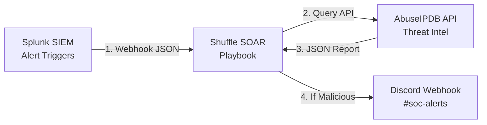

# 🤖 Security Engineering & Automation Lab: SOAR Alert Enrichment

This guide outlines how to build a **SOAR (Security Orchestration, Automation, and Response)** workflow. You will automate the enrichment of security alerts, reducing alert fatigue and accelerating incident triage.

* **The Problem:** SOC analysts receive hundreds of alerts containing IP addresses. Manually copying and pasting these IPs into threat intelligence sites is slow and repetitive.
* **The Solution:** Automate this triage. When a Splunk alert triggers, a SOAR playbook automatically queries a Threat Intelligence API, scores the IP, and routes it to Discord.

---

## 🏗️ Automation Workflow

Here is how the automated enrichment pipeline works:



---

## 🛠️ Step-by-Step Lab Setup

### 📥 Phase 1: Accounts & Tooling Setup
1. **Create an AbuseIPDB Account:** Go to [AbuseIPDB](https://www.abuseipdb.com/), register a free account, and generate a free **API Key** under the Account tab.
2. **Access Shuffle SOAR:** Sign up for a free cloud account at [Shuffle](https://shuffler.io/) (an open-source SOAR platform) or run it locally in a container:
   ```bash
   docker run -d -p 3001:3000 shuffler/shuffle:latest
   ```
3. **Configure Discord Webhook:** Create a personal Discord server, add a channel named `#soc-alerts`, go to Channel Settings -> **Integrations** -> **Webhooks**, and copy the **Webhook URL**.

---

### 🎨 Phase 2: Building the SOAR Playbook in Shuffle

1. **Create a Playbook:** Open Shuffle and click **Create New Playbook**. Name it `Enrich Splunk Alerts`.
2. **Add a Webhook Trigger:**
   * Drag the **Webhook** node onto the canvas.
   * Shuffle will generate a unique Webhook URL. Copy this URL.
3. **Add the AbuseIPDB Node:**
   * Drag the **HTTP** app node onto the canvas and link it to the Webhook node.
   * Configure it as a `GET` request:
     * **URL:** `https://api.abuseipdb.com/api/v2/check`
     * **Headers:** 
       * `Key: <Your_AbuseIPDB_API_Key>`
       * `Accept: application/json`
     * **Parameters:**
       * `ipAddress: $trigger.body.ip` (This pulls the IP dynamically from the incoming webhook payload).
4. **Add Conditional Logic (If-Else):**
   * Link a new **Conditional** step.
   * Set the rule: If `abuseScore` (returned from AbuseIPDB JSON) is **greater than 50**:
     * Route to **Discord Node** (True branch).
     * Otherwise: Route to **Close Ticket** / End playbook (False branch).
5. **Add the Discord Webhook Node:**
   * Drag a second **HTTP** app node onto the canvas.
   * Configure it as a `POST` request to your **Discord Webhook URL**.
   * Set the Body payload (JSON) to display a clean alert message:
     ```json
     {
       "content": "🚨 **CRITICAL SECURITY ALERT: MALICIOUS IP DETECTED**\n\n**Target IP:** $check_ip.body.data.ipAddress\n**Abuse Confidence Score:** $check_ip.body.data.abuseConfidenceScore%\n**Country:** $check_ip.body.data.countryCode\n**Usage Type:** $check_ip.body.data.usageType\n\n*Playbook automatically enriching. Immediate analyst triage recommended.*"
     }
     ```

---

## 🎯 Phase 3: Triggering & Testing the Pipeline

### 🐍 Step 1: Simulate the Splunk Alert (Python Script)
To test the pipeline without waiting for a real Splunk alert, write a simple Python script to simulate a webhook payload. Save this locally as `test_webhook.py`:

```python
import requests
import json

# Replace with the Webhook URL generated inside your Shuffle Playbook
SHUFFLE_WEBHOOK_URL = "https://shuffler.io/api/v1/hooks/your_hook_id_here"

# Test Payload containing a known malicious IP (e.g., a scanner IP)
payload = {
    "event_id": "SEC-1002",
    "alert_name": "Suspicious External Login Attempt",
    "ip": "118.25.6.39",  # Sample test IP
    "username": "admin"
}

response = requests.post(
    SHUFFLE_WEBHOOK_URL,
    headers={"Content-Type": "application/json"},
    data=json.dumps(payload)
)

print(f"Trigger Status Code: {response.status_code}")
print(f"Response: {response.text}")
```

### 🔬 Step 2: Verify Execution
1. Run the Python script: `python test_webhook.py`.
2. Look at the **Shuffle execution logs**—you should see the webhook activate, query AbuseIPDB, verify the score, and route the data.
3. Check your **Discord Channel**. You should receive a real-time, beautifully formatted rich security alert detailing the malicious IP!

---

## 📈 Portfolio Integration
Add a new section to your project portfolio documenting this work. It shows:
* **API Integration:** Extracting and parsing JSON payloads across multiple tools.
* **SOAR Playbooks:** Designing conditional workflow logic to reduce manual triage.
* **Real-time Alerting:** Connecting SIEM intelligence to operational communication channels.
